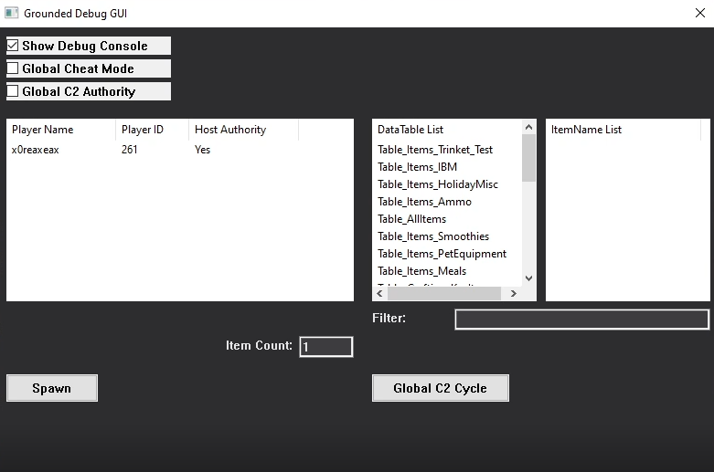

# GroundedMinimal - Small debug/cheat/mod tool for Grounded (Steam version)

## !!!IMPORTANT PLZ READ!!!
Under set configurations, this tool can allow any connected players to **EXECUTE CONTROLLED CODE ON YOUR MACHINE**.  
Only use this tool with people you trust, and only if you understand the risks involved.  

Additionally, the tool allows for spawning experimental and unimplemented items, which can potentially break your save files or cause other issues.  
It is highly recommended to **BACKUP YOUR SAVE FILES** before using this tool, especially if you're experimenting with spawning random items.  

Please refer to the [Notes](#notes) section for more information.


## Interfaces
 - **Ugly-ass GUI:** A simple window for convenience and abstraction of command line, copypasted straight out of MS Docs Examples.
 - **Broken CLI:** With a hand-half-full of commands.
 - **Chat Commands:** If you don't want to ALT-TAB all the time.

## Features
 - **C2Cycle (TM pending):** A "fix" for massive amount of clumped AntHill food chunks. Features automated "Collect and Cull" cycles, which detect big amounts of clumped food items inside various "hotspots" on the map, and clean them up. Also features the worst possible existing algorithm that a sentient being could use.
 - **Item Spawner:** Allows either the host of the game lobby, but optionally also all connected players to spawn game items into their inventories.
 - **Debug Helpers:** Misc utils for dumping internal item names and data tables, as well as gathering lobby and player info.
 - **That's it:** Adheres to the "Minimal" part of the program's name.

## Getting started
 1. Download or build GroundedMinimal.dll
 2. Load into the game. Like actually load into the world, not just main menu.
 3. Inject GroundedMinimal.dll into `Maine-Win64-Shipping.exe` using your fave injector.
 4. Enjoy

*Sideloading is broken rn, don't try to sideload this as `DBGCORE.DLL`*

## GUI Usage

The simple GUI provides the following features:
### Settings
 - **Shod Debug Console:** Shows/Hides the debug console.
 - **Global Cheat Mode:** Controls whether connected players are allowed to spawn items using chat commands.
 - **Global C2 Authority:** Controls whether connected players are allowed to trigger C2Cycles using chat commands.

### C2Cycle
 - **C2Cycle:** Triggers a C2Cycle (the game might freeze for a second or two).  
If "Global C2 Authority" is enabled, all connected players can trigger a C2Cycle using the in-game chat command `/c2cycle`. Yep, just type it. The host can always use this command, regardless of the setting.  

### Item Spawner
#### Spawning via GUI
The player list tab will display connected players. This tab refreshes every 5 seconds (or 7 seconds if you're actively interacting with the GUI).  

The DataTable tab will display all internal data tables, which are basically groups that contain different items. Usually `Table_AllItems` is the one you want to use, unless you're experimenting.  

The ItemName tab will display all internal item names contained within the selected data table. You can search for items by typing in the "Filter" search box, however, the names can sometimes be unintuitive.  

The Item Count field allows you to specify how many items you want to spawn. By default it is set to 1, with maximum being hardcapped to 999.  

In order to spawn an item:
 1.  Select a player from the list who will receive the item.
 2.  Select a data table from the dropdown.
 3.  Select an item from the dropdown.
 3.5 Optionally, you can specify the quantity.
 4.  Click the "Spawn Item" button.

#### Spawning via Chat Commands
It is possible to spawn items using the in-game chat, however, you must know the target item's internal name, in order to do so.  
Once you have that, you can use enter the following command into the chat:  
```
/spawnitem <item_name> [<quantity>]
```
`<item_name>` is the internal name of the item you want to spawn, and `<quantity>` is an optional parameter that specifies how many items you want to spawn (default is 1, maximum is 999).  
  
You **CANNOT** spawn items into other players' inventories via chat commands.  
  
Example: `/spawnitem DandelionPuff 10`

#### Spawning via CLI
Refer to [CLI Usage](#cli-usage).

## CLI Usage
The debug console can be used to execute the following commands:

| Command             | Description               |
| -----------------   | --------------------------|
| `C2`                | Triggers a C2Cycle |
| `H_GetAuthority`    | Checks if you're the host |
| `X_GlobalCheatMode` | Toggles Global Cheat Mode |
| `X_DebugToggle`     | Toggles debug output (very spammy and performance heavy) |
| `P_ShowPlayers`     | Lists connected players |
| `F_FunctionDump`    | Finds all functions containing a given string needle |
| `F_DataTableNeedle` | Finds all data tables containing a given string needle |
| `F_FindItemTable`   | Finds all data tables containing a given item name |
| `F_ItemDump`        | Finds all items within a given data table name |
| `C_CullItem`        | Culls a specific item via the item's ID |
| `C_CullItemType`    | Culls all items of a specific type (name) around the players |
| `I_SpawnItem`       | Spawns a selected item into a selected player's inventory |
| `<Item Name Needle>`| Searches for spawned items around the player by a given name needle (empty input displays all) |
| `exit` or `quit`    | Unloads game hooks and exits the tool |

## Building
To build the project, you need to have a valid SDK dump generated via [Dumper-7](https://github.com/Encryqed/Dumper-7).  
Once you have the SDK dump, place the contents of `CppSDK` directory into `GroundedMinimal\GroundedMinimal`, i.e. `$(ProjectDir)`.  
Here's a reference tree:
```
GroundedMinimal [$(ProjectDir)]:
|   dllmain.cpp
|   blah blah blah cpp/hpp
|   NameCollisions.inl
|   PropertyFixup.hpp
|   SDK.hpp
|   UnrealContainers.hpp
|   UtfN.hpp
+---SDK/
|       sdk gen cpp/hpp
|       blah blah blah
```

C++17 or higher is required.

## Notes
 - This tool is more of a proof of concept meme than a dependable tool. I have zero knowledge in OOP, and minimal knowledge of Unreal Engine, or non-C C++ features.
 - Please **BACKUP YOUR SAVE FILES** before using this tool, especially if you're experimenting with spawning random weird sheit.
 - Please note that if "Global Cheat Mode" or "Global C2 Authority" is enabled, all connected players can use the chat commands to spawn items or trigger C2Cycles, respectively, which means that players can **!!!EXECUTE CONTROLLED CODE ON YOUR MACHINE!!!**.  
  This code is controlled, but I cannot guarantee that it cannot be exploited, so please only use this tool with people you trust.
 - Crashes may occur when (re)loading saves, or backing out to the main menu.
 - Upon exiting the game, the tool sometimes keeps the game process running, so consider killing it manually.
 - The tool was only tested with the Steam version of Grounded, and may not work with Xbox Game Pass or *other* versions.
 - The tool was only tested with 2 players, because I don't have friends (F).

## Extending
The code is a complete dog<bleep> mess, I have no idea what I'm doing when it comes to OOP and Unreal Engine, but I tried to keep it as modular as possible.  
File Index:

* `C2Cycle.cpp/hpp` - C2Cycle implementation, the original purpose of this tool, internally referred to as "GroundedAntDiet".
* `Command.cpp/hpp` - Command buffer processed inside the game thread via hooked process events.
* `HookManager.cpp/hpp` - Manages ProcessEvent hooks.
* `ItemSpawner.cpp/hpp` - Item Spawner implementation.
* `UnrealUtils.cpp/hpp` - Misc Unreal Engine helper utilities.
* `WinGUI.cpp/hpp` - The GUI "implementation" lol.
* `dllmain.cpp` - The main entry and command line interpreter implementation.
* `dbgcore.cpp` - Unfinished/broken `DBGCORE.DLL` sideloading implementation (don't rely on this).

## Credits
 - [Dumper-7](https://github.com/Encryqed/Dumper-7) - Used to generate the SDK dump.
 - [Unreal Engine Documentation](https://dev.epicgames.com/documentation/en-us/unreal-engine) - Misc UE stuff.
 - [MS Docs](https://learn.microsoft.com/en-us/windows/win32/learnwin32/learn-to-program-for-windows--sample-code) - GUI skeleton copypasta.

## Disclaimer
This project is licensed under the [GNU General Public License v3.0](#license).  
The content of this repository exists purely for educational purposes, and the author is not responsible for any damages caused by this software.

## License
    GroundedMinimal - Debugging tool for Grounded (Steam version)
    Copyright (C) 2025  x0reaxeax

    This program is free software: you can redistribute it and/or modify
    it under the terms of the GNU General Public License as published by
    the Free Software Foundation, either version 3 of the License, or
    (at your option) any later version.

    This program is distributed in the hope that it will be useful,
    but WITHOUT ANY WARRANTY; without even the implied warranty of
    MERCHANTABILITY or FITNESS FOR A PARTICULAR PURPOSE.  See the
    GNU General Public License for more details.

    You should have received a copy of the GNU General Public License
    along with this program.  If not, see <https://www.gnu.org/licenses/>.